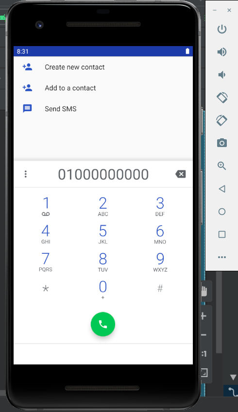
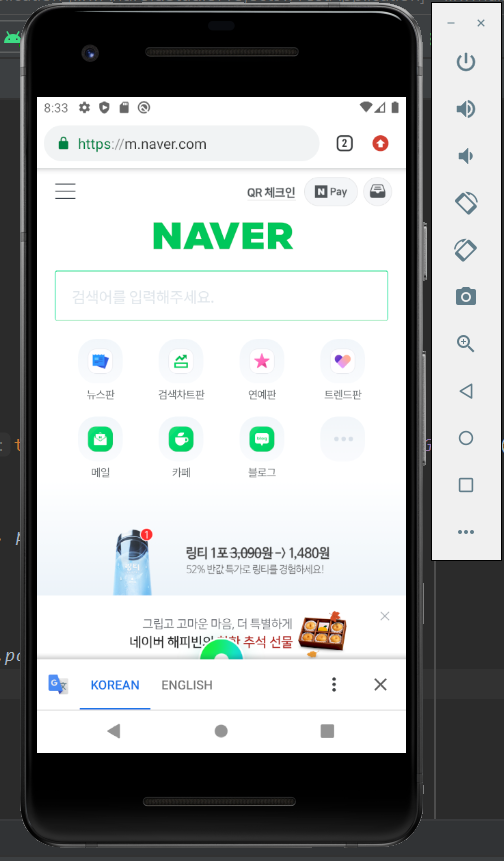

# 19173034 박민선
## 3주차 과제
</img>
</img>
## 4주차 과제
   아이디어 명 : 화장품 유통기한을 알려주는 어플
  
   기획 배경 : 우리가 매일 사용하는 스킨 로션 등 피부에 직접적으로 접촉되는 제품들에는 유통기한이 있다. 제품마다 사용할 수 있는 기간을 인지하고 있지 못하면 제품의 효과보다는 부작용이 더 많이 생기곤 한다. 그래서 사용자가 제품을 개봉하는 날에 어플을 이용해서 개봉날짜와 사용기간을 입력하면 어플에서 유통기간이 다 되가는 제품들을 자동으로 알려줄 수 있다. 어플을 통해 사용자가 제품의 보관날짜를 인지하고 오래된 제품들을 버리게 되는 새로운 습관들을 만들어가고자 한다. 
      
## 7주차 과제
<image width="" height="" src="./png/re.png"></img>
<image width="" height="" src="./png/re1.png"></img>
